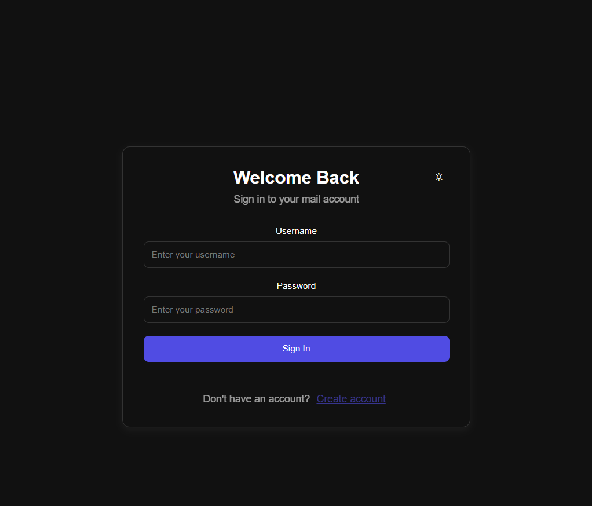
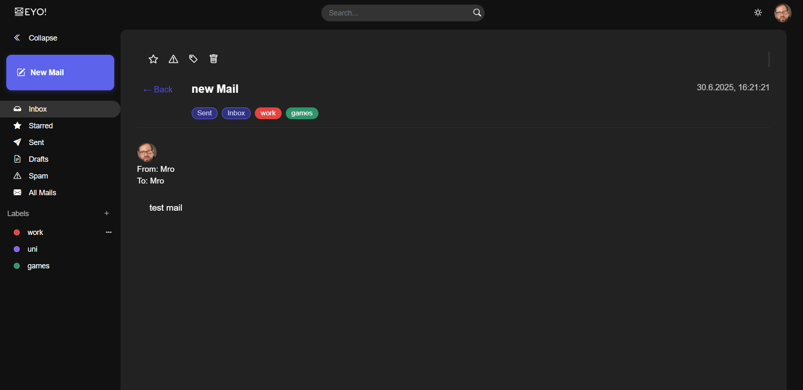

# ASP Project: Bloom Filter Mail Application

## Overview
This project provides a **mailbox-like** application with a modern web interface that uses a RESTful web server to manage user authentication, mailbox operations, and a Bloom Filter for URL blacklisting. The application is designed to check membership of URLs in a blacklist, ensuring that unwanted URLs are filtered out from mails. The project includes a React-based web application for user interaction and a Node.js backend API server.

---

## Features
- **Modern Web Interface**
  - React-based application.
  - User-friendly interface for mailbox management.
  - Authentication system with login and registration.
  - Real-time interaction with the backend API.
  - Responsive design for desktop and mobile devices.

- **Bloom Filter Implementation**  
  - Efficient membership checking for URLs.
  - Utilizes multiple hash functions.
  - Persists blacklisted URLs to a file for future sessions.
  - communication with the server via a command-based interface.

- **Command-Based Interface**  
  - `GET <url>`: Check if a URL is blacklisted.
  - `POST <url>`: Add a URL to the blacklist.
  - `DELETE <url>`: Remove a URL from the blacklist.
  - for more details, see the [documentation](doc/protocol.md).

- **Persistence**  
  - Blacklisted URLs are stored in `data/bloom_filter_data.txt` and reloaded at startup.

- **Web Server (Backend API)**
  - Provides a RESTful API for interacting with the Bloom Filter and managing mails.
  - Built using Node.js and Express.
  - Supports user authentication, mail operations, and URL blacklisting.
  - Token-based authentication system.

- **Unit Testing**  
  - Extensive tests using Google Test (`gtest`).
  - Tests cover initialization, persistence, main application flow, and more.

- **Dockerized Environment**  
  - Separate Docker Compose services for the application and tests.

---

## Project Structure

  - **web_app/**:  
    - `src/`: React application source code.
    - `public/`: Static assets and HTML template.
    - `src/components/`: Reusable UI components (auth, home, mail, etc.).
    - `src/context/`: React context providers for authentication and theming.
    - `package.json`: Frontend dependencies and build scripts.
    - `Dockerfile`: Docker configuration for the web application.

  - **web_server/**:  
    - `controllers/`: Contains the web server controllers.
    - `models/`: Contains the data models.
    - `routes/`: Defines the routes for the web server.
    - `app.js`: Main entry point for the web server.
  

  - **url_server/**:  
    - `src/`: Main application logic.
    - `data/`: Persistent storage for the Bloom Filter.
    - `include/`: Header files.
    - `tests/`: Unit tests for the Bloom Filter and related components.

- **doc**
  - `doc/`: Documentation files.

- **Build Configuration**  
  - `CMakeLists.txt`: CMake build configuration.
  - `Dockerfile`: Docker image setup.
  - `package.json`: Node.js dependencies for the web server.
  - `package-lock.json`: Lock file for Node.js dependencies.

- **Docker Compose**  
  - `docker-compose.yml`: Defines services for running the app and tests.

- **Images**
  - `images/`: Contains example images for usage and testing.

---

## How to Build and Run

### Prerequisites
- Docker and Docker Compose installed.
- CMake (if building locally).

### Build and Run with Docker
**to run the project use steps 1 and 6 only!**
1. **Build the Docker Images**:
   ```sh
   docker-compose build
   ```

2. **Run the Application (URL Server Only)**:
   ```sh
   docker-compose run --service-ports url_server
   ```

3. **Run the URL Client (With The URL Server)**:
   ```sh
   docker-compose run url_client
   ```

4. **Run the URL Server Tests**:
   ```sh
   docker-compose run url_tests
   ```

5. **Run the Web Server (Backend API)**:
   ```sh
    docker-compose run --service-ports web_server
    ```

6. **Run the Web Application (Frontend)**:
   ```sh
    docker-compose run --service-ports web_app
    ```

### Development Mode
For development with hot-reload:

1. **Start the Web Server**:
   ```sh
   cd web_server
   npm install
   npm start
   ```

2. **Start the Web Application**:
   ```sh
   cd web_app
   npm install
   npm start
   ```

The web application will be available at `http://localhost:8080` and will communicate with the API server at `http://localhost:3000`.
---

## API Usage Examples

### Web Interface
The web application provides a user-friendly interface for:
- User registration and login
- Viewing and managing emails
- Composing and sending messages
- Managing blacklisted URLs
- Searching through emails

#### Main Application Pages

1. **Authentication Pages** (`/login`, `/register`)
   - User login interface with username/password authentication
   - User registration form for creating new accounts
   - Token-based authentication with automatic validation
   - Responsive design with modern UI components
   
   

2. **Home/Dashboard Page** (`/`)
   - Main mailbox interface with email list view
   - Navigation sidebar with categories
   - Action toolbar for email operations (compose, delete, search)
   - Real-time email management and interaction
   
   

3. **Mail Management Pages**
   - Individual email view with full content display
   - Compose email interface for creating new messages
   - Responsive layout for optimal viewing experience
   
   

### REST API Examples
The following examples show direct API usage via curl commands:


```bat
C:\Windows>curl -i -X POST http://127.0.0.1:3000/api/users -H "Content-Type: application/json" -d "{\"firstName\":\"Foo\",\"lastName\":\"Bar\",\"birthday\":\"2001-09-11\",\"username\":\"Foobar\",\"password\":\"1337secret\"}" 
HTTP/1.1 201 Created
X-Powered-By: Express
Location: api/users/Foobar
Content-Type: application/json; charset=utf-8
Content-Length: 39
ETag: W/"27-O/zF1M4EsSeqcgZOzAXUbc5OpUA"
Date: Tue, 03 Jun 2025 16:41:53 GMT
Connection: keep-alive
Keep-Alive: timeout=5

{"message":"User created successfully"}
C:\Windows>curl -i -X POST http://127.0.0.1:3000/api/users -H "Content-Type: application/json" -d "{\"firstName\":\"omri\",\"lastName\":\"bareket\",\"birthday\":\"2007-03-29\",\"username\":\"Mro\",\"password\":\"p455w0rd\"}" 
HTTP/1.1 201 Created
X-Powered-By: Express
Location: api/users/Mro
Content-Type: application/json; charset=utf-8
Content-Length: 39
ETag: W/"27-O/zF1M4EsSeqcgZOzAXUbc5OpUA"
Date: Tue, 03 Jun 2025 16:41:54 GMT
Connection: keep-alive
Keep-Alive: timeout=5

{"message":"User created successfully"}
C:\Windows>curl -i -X POST http://127.0.0.1:3000/api/tokens -H "Content-Type: application/json" -d "{\"username\":\"Foobar\",\"password\":\"1337secret\"}" 
HTTP/1.1 201 Created
X-Powered-By: Express
Content-Type: application/json; charset=utf-8
Content-Length: 18
ETag: W/"12-V59NTCvdeD/8jlB0BoV+f7Se0pg"
Date: Tue, 03 Jun 2025 16:41:54 GMT
Connection: keep-alive
Keep-Alive: timeout=5

{"token":"Foobar"}
C:\Windows>curl -i -X GET http://127.0.0.1:3000/api/users/Foobar 
HTTP/1.1 200 OK
X-Powered-By: Express
Content-Type: application/json; charset=utf-8
Content-Length: 145
ETag: W/"91-+ddMpJeulVdyvyavI6Nl+oloYVE"
Date: Tue, 03 Jun 2025 16:41:54 GMT
Connection: keep-alive
Keep-Alive: timeout=5

{"id":"Foobar","firstName":"Foo","lastName":"Bar","birthday":"2001-09-11","email":"Foobar@example.com","photo":"https://i.sstatic.net/frlIf.png"}
C:\Windows>curl -i -X GET http://127.0.0.1:3000/api/users/nonexistentuser 
HTTP/1.1 404 Not Found
X-Powered-By: Express
Content-Type: application/json; charset=utf-8
Content-Length: 53
ETag: W/"35-tHg+MCSy1KRnCyykxkoz01pbVG0"
Date: Tue, 03 Jun 2025 16:41:54 GMT
Connection: keep-alive
Keep-Alive: timeout=5

{"message":"User not found","error":"User not found"}
C:\Windows>curl -i -X POST http://127.0.0.1:3000/api/mails -H "Authorization: Foobar" -H "Content-Type: application/json" -d "{\"to\":\"Mro\",\"subject\":\"asdfasdfasdfasd\",\"body\":\"From Foobar to Mro\"}" 
HTTP/1.1 201 Created
X-Powered-By: Express
Location: /api/mails/1
Date: Tue, 03 Jun 2025 16:41:54 GMT
Connection: keep-alive
Keep-Alive: timeout=5
Content-Length: 0
C:\Windows>curl -i -X POST http://127.0.0.1:3000/api/mails -H "Authorization: nonexistentuser" -H "Content-Type: application/json" -d "{\"to\":\"Foobar\",\"subject\":\"Test\",\"body\":\"From nonexistentuser to Foobar\"}" 
HTTP/1.1 400 Bad Request
X-Powered-By: Express
Content-Type: application/json; charset=utf-8
Content-Length: 26
ETag: W/"1a-hq/hT0ORGTkTfyRpVCZ/JB/r8Eg"
Date: Tue, 03 Jun 2025 16:41:54 GMT
Connection: keep-alive
Keep-Alive: timeout=5

{"error":"User not found"}
C:\Windows>curl -i -X POST http://127.0.0.1:3000/api/mails -H "Authorization: Foobar" -H "Content-Type: application/json" -d "{\"to\":\"nonexistentuser\",\"subject\":\"Test\",\"body\":\"From Foobar to nonexistentuser\"}" 
HTTP/1.1 400 Bad Request
X-Powered-By: Express
Content-Type: application/json; charset=utf-8
Content-Length: 26
ETag: W/"1a-hq/hT0ORGTkTfyRpVCZ/JB/r8Eg"
Date: Tue, 03 Jun 2025 16:41:54 GMT
Connection: keep-alive
Keep-Alive: timeout=5

{"error":"User not found"}
C:\Windows>curl -i -X PATCH http://127.0.0.1:3000/api/mails/1 -H "Authorization: Foobar" -H "Content-Type: application/json" -d "{\"body\":\"Updated Body\"}" 
HTTP/1.1 204 No Content
X-Powered-By: Express
Location: /api/mails/1
Date: Tue, 03 Jun 2025 16:41:54 GMT
Connection: keep-alive
Keep-Alive: timeout=5


C:\Windows>curl -i -X GET http://127.0.0.1:3000/api/mails/1 -H "Authorization: Mro" 
HTTP/1.1 200 OK
X-Powered-By: Express
Content-Type: application/json; charset=utf-8
Content-Length: 150
ETag: W/"96-CsGLrGtLO+yd4DPdJn33F5ni9Lc"
Date: Tue, 03 Jun 2025 16:41:54 GMT
Connection: keep-alive
Keep-Alive: timeout=5

{"id":1,"from":"Foobar","to":"Mro","cc":[],"subject":"asdfasdfasdfasd","body":"From Foobar to Mro","date":"2025-06-03T16:41:54.307Z","attachments":[]}
C:\Windows>curl -i -X GET http://127.0.0.1:3000/api/search/T -H "Authorization: Foobar" 
HTTP/1.1 200 OK
X-Powered-By: Express
Content-Type: application/json; charset=utf-8
Content-Length: 296
ETag: W/"128-n1jNaUUNWPTEp8XZrJ5rXHyiZmE"
Date: Tue, 03 Jun 2025 16:41:54 GMT
Connection: keep-alive
Keep-Alive: timeout=5
[{"id":1,"from":"Foobar","to":"Mro","cc":[],"subject":"asdfasdfasdfasd","body":"Updated Body","date":"2025-06-03T16:41:54.307Z","attachments":[]}]

...
```

---

## Testing
The project includes unit tests for:
- Bloom Filter initialization and functionality.
- Persistence of blacklisted URLs.
- Handling of invalid inputs.

To run the tests:
```sh
docker-compose run url_tests
```

---

## Future Improvements
- Enhance the React UI with more advanced features like drag-and-drop email management.
- Add real-time notifications for new emails.
- Implement email attachments handling in the web interface.
- Add a database for better data management and scalability.
- Implement email templates and formatting options.

---

## Contributors
- *Omri Bareket*
- *Yuli Smishkis*
- *Eviatar Sayada*