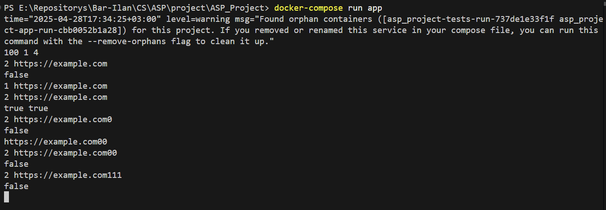
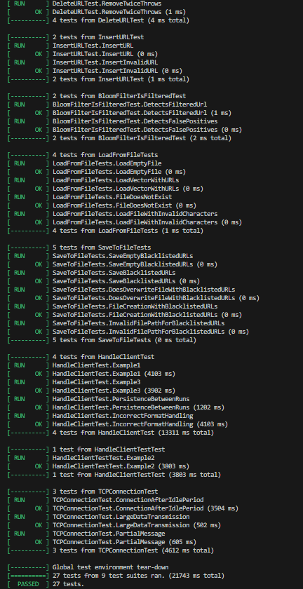

# ASP Project: Bloom Filter Application

## Overview
This project implements a **Bloom Filter** application in C++ to efficiently manage and query blacklisted URLs. The application supports inserting URLs, checking if a URL is blacklisted, and persisting data across runs using a file-based persistence mechanism.

The project is containerized using Docker and includes unit tests to ensure correctness.

---

## Features
- **Bloom Filter Implementation**:
  - Efficiently checks membership of URLs.
  - Supports multiple hash functions.
  - Persists blacklisted URLs to a file for future use.

- **Command-Based Interface**:
  - `1 <URL>`: Insert a URL into the Bloom Filter.
  - `2 <URL>`: Check if a URL is blacklisted.

- **Persistence**:
  - Blacklisted URLs are saved to a file (`data/bloom_filter_data.txt`) and reloaded on application startup.

- **Unit Testing**:
  - Comprehensive tests using Google Test (`gtest`).
  - Tests include initialization, persistence, main application flow, and more.

- **Dockerized Environment**:
  - Separate services for running the application and tests using `docker-compose`.

---

## Project Structure
- **Source Code**:
  - `src/`: Contains the main application logic.
  - `include/`: Header files for the application.

- **Tests**:
  - `tests/`: Unit tests for the Bloom Filter and related components.

- **Data**
  - `data/`: all data related to the bloom filter persistence.

- **Build Configuration**:
  - `CMakeLists.txt`: Build configuration for the project.
  - `Dockerfile`: Docker image setup for building and running the application.

- **Docker Compose**:
  - `docker-compose.yml`: Defines services for running the app and tests.

---

## How to Build and Run

### Prerequisites
- Docker and Docker Compose installed.
- CMake (if building locally).

### Build and Run with Docker
1. **Build the Docker Images**:
   ```sh
   docker-compose build
   ```

2. **Run the Application**:
   ```sh
   docker-compose run app
   ```

3. **Run the Tests**:
   ```sh
   docker-compose run tests
   ```

---

## Example Usage



### Input
```plaintext
8 1 2
1 www.example.com
2 www.example.com
2 www.test.com
```

### Output
```plaintext
true true
true false
```

---

## Testing
The project includes unit tests for:
- Bloom Filter initialization and functionality.
- Persistence of blacklisted URLs.
- Handling of invalid inputs.

To run the tests:
```sh
docker-compose run tests
```

---

## Future Improvements
- Implement additional commands for managing blacklisted URLs.
- create more ways to handle input and persistence

---

## Contributors
- *Omri Bareket*
- *Yuli Smishkis*
- *Eviatar Sayada*